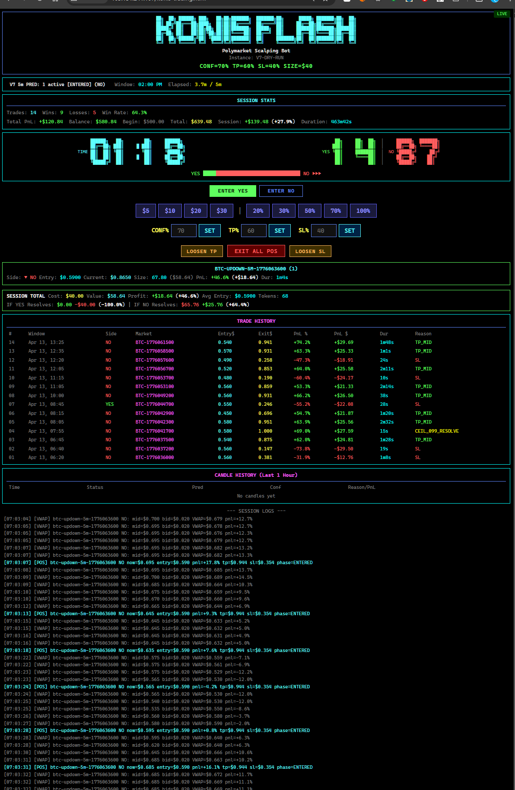
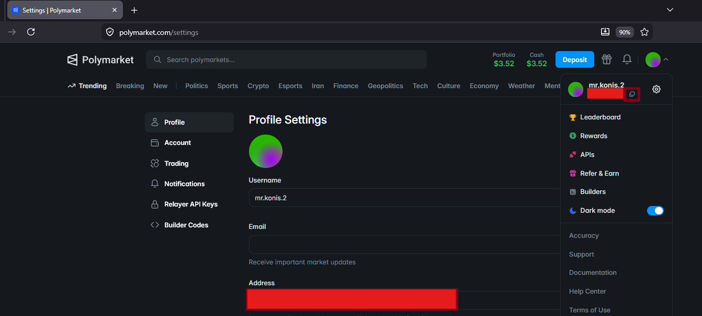

# Open Source Polymarket Trading Bot

[](https://paypal.me/konistech)

Built independently alongside a growing startup.
If this project helped you, consider supporting its development:

👉 https://paypal.me/konistech

---

**Open source trading bot for [Polymarket](https://polymarket.com) binary outcome markets (BTC, ETH, SOL, XRP).**

This repo includes **two bot versions** with different strategies:

| | **V3** | **V7** |
|---|--------|--------|
| **Strategy** | DCA, Rebalance, Volatility Farming | Manual Trading or Prediction-Based |
| **Markets** | 15-minute windows | 5-minute windows |
| **Entry** | Dual-side (YES + NO) with DCA averaging | Single-side based on prediction or manual click |
| **Exit** | Combined TP, rebalance sells, loss cuts | Hold for resolution, TP/SL, or prediction exit |
| **Config** | `.env.v3.example` | `.env.v7.example` |
| **Run** | `python konis-trading-v3.py` | `python konis-trading-v7.py` |

Out of the box, **V7** works as a **standalone trading terminal** — use the web dashboard to manually enter YES/NO positions with one click, set TP/SL, and manage exits in real time. No prediction API required. Set `V7_MANAGE_POSITIONS_ONLY=true` and you're ready to trade.

**Prerequisites:** Install [Redis](https://redis.io/download) on localhost (the bot publishes its state to Redis for the dashboard and health checks).

**Optionally**, connect to the [KoNiS AI](https://konis.ai) prediction engine for **fully automated trading**. The prediction engine analyzes real-time data from **7 centralized exchanges** (Binance, OKX, Bybit, Gate.io, Phemex, CoinEx, BingX) and whale flows to predict short-term price direction with 65–92% accuracy.

> **Prediction API & RPC endpoints are provided through [konis.ai](https://konis.ai)**
> Sign up to get your prediction API credentials for automated mode.

---

## Table of Contents

- [How It Works](#how-it-works)
- [Strategy Overview](#strategy-overview)
- [Project Structure](#project-structure)
- [Requirements](#requirements)
- [Installation](#installation)
- [Wallet Setup](#wallet-setup)
- [Configuration](#configuration)
- [Running the Bot](#running-the-bot)
- [Configuration Reference](#configuration-reference)
- [Trading Modes](#trading-modes)
- [Risk Management](#risk-management)
- [Monitoring](#monitoring)
- [Redeem Service](#redeem-service-auto-claim-winnings)
- [FAQ](#faq)
- [Disclaimer](#disclaimer)

---

## How It Works



The bot supports two operating modes:

### V7 Mode 1: Manual Entry (Dashboard)

```env
V7_MANAGE_POSITIONS_ONLY=true
```

In this mode, the bot does **not** auto-enter positions. Instead, you use the **KoNiS Flash Dashboard** (web UI) to manually enter and manage positions with one-click buttons.

**Start the dashboard:**

```bash
# Terminal 1: Start the bot
python konis-trading-v7.py --env .env

# Terminal 2: Start the dashboard server
python dashboard/dashboard-server.py

# Open http://localhost:8901 in your browser
```

> **Requires Redis** running on localhost:6379. The bot publishes live state to Redis, and the dashboard reads it.
> Install Redis: [redis.io/download](https://redis.io/download) | Ubuntu: `sudo apt install redis-server` | Mac: `brew install redis` | Windows: use [Memurai](https://www.memurai.com/) or WSL.

**Dashboard features:**
- **ENTER YES / ENTER NO** — One-click entry on either side
- **Position sizing** — Quick buttons ($5, $10, $20, $30) or percentage of balance (20%, 30%, 50%, 70%, 100%)
- **Live controls** — Adjust CONF%, TP%, SL% on the fly
- **LOOSEN TP / LOOSEN SL** — Relax thresholds for active positions
- **EXIT ALL POS** — Emergency exit all positions immediately
- **Real-time display** — Countdown timer, YES/NO prices, prediction bar, session stats

This mode is ideal for traders who want to see the prediction data and make their own entry decisions.

### V7 Mode 2: Prediction-Based (Automated)

```env
V7_MANAGE_POSITIONS_ONLY=false
```

The bot automatically enters positions based on KoNiS AI prediction signals:

```
┌─────────────────────────────────────────────────────────────────┐
│                    KoNiS Prediction Engine                      │
│              (https://konis.ai — sign up required)              │
│                                                                 │
│  Multi-pair ML model analyzing BTC, ETH, SOL, XRP price action │
│  Outputs: direction (UP/DOWN), confidence (0-1), quality score  │
│  Delivery: HTTP API or WebSocket stream                         │
└──────────────────────────┬──────────────────────────────────────┘
                           │ prediction signal
                           ▼
┌─────────────────────────────────────────────────────────────────┐
│                   KoNiS Trading Bot v7                          │
│                                                                 │
│  ┌──────────┐  ┌──────────┐  ┌──────────┐  ┌──────────┐       │
│  │  ENTRY   │→ │  HEDGE   │→ │   HOLD   │→ │ ARCHIVE  │       │
│  │          │  │(optional)│  │          │  │          │       │
│  │ Buy YES  │  │ Hedge w/ │  │ Wait for │  │ Log PnL  │       │
│  │ or NO    │  │ opposite │  │ market   │  │ Clear    │       │
│  │ based on │  │ side if  │  │ resolve  │  │ state    │       │
│  │ predict  │  │ volatile │  │ ($1/$0)  │  │ Next win │       │
│  └──────────┘  └──────────┘  └──────────┘  └──────────┘       │
│                                                                 │
│  Polymarket CLOB API ←→ Polygon blockchain                      │
└─────────────────────────────────────────────────────────────────┘
```

**Each 5-minute window:**

1. **ENTRY** — Bot receives prediction (UP or DOWN with confidence score). If confidence meets threshold, it buys YES or NO tokens on Polymarket at current market price.
2. **HEDGE** (optional) — If volatility spikes, bot can hedge by buying the opposite side at a cheap price.
3. **HOLD** — Bot holds until the 5-minute market resolves. Winning tokens → $1.00, losing → $0.00. Early exit is driven by `V7_SL_RATIO` (stop loss) and `V7_TP_RATIO` (take profit). Set both to `0` to fully hold and trust the prediction data. Hint: `V7_SL_RATIO=0.40` (i.e. ~60-70% loss from entry) is safe in most cases — if a position dips below this, ~95% of the time it won't bounce back.
4. **ARCHIVE** — PnL is calculated and logged. State is cleared for the next window.

---

## Strategy Overview

### Polymarket Binary Outcome Markets

Polymarket offers ultra-short-term binary outcome markets (e.g., "Will BTC price be higher in 5/15 minutes?"). These markets:

- Resolve every 5 or 15 minutes with a definitive YES/NO outcome
- YES + NO tokens always sum to $1.00
- Entry prices typically range $0.30–$0.70 (50/50 markets hover around $0.50)
- Profit = $1.00 minus entry price on a correct prediction

### Edge: KoNiS Prediction Engine

The KoNiS AI model ingests real-time data from **7 CEXs** (Binance, OKX, Bybit, Gate.io, Phemex, CoinEx, BingX) and whale flows, analyzing multiple crypto pairs simultaneously to predict short-term price direction. Key prediction metrics:

| Metric | Description |
|--------|-------------|
| **Direction** | UP or DOWN prediction for the next window |
| **Confidence** | 0.0–1.0 score (higher = more certain) |
| **Quality Score** | Signal quality based on multi-pair agreement |
| **Weighted Signal** | Combined confidence × quality metric |

**Backtest performance (BTC 5m, 8,641 windows):**

| Elapsed (sec) | Confidence | Accuracy |
|---------------|------------|----------|
| 0 | 50.0% | 50.0% |
| 60 | 82.1% | 65.4% |
| 120 | 83.4% | 71.2% |
| 180 | 83.5% | 78.4% |
| 240 | 83.6% | 85.8% |
| 295 | 83.6% | 92.0% |

The model's confidence stabilizes around 60 seconds into each window, with accuracy improving as the window progresses.

### V3 Strategy: DCA, Rebalance & Volatility Farming

V3 trades **15-minute markets** with a fundamentally different approach — instead of picking one side, it maintains **dual-side positions** (both YES and NO) and profits through position management:

1. **Entry** — Buys the predicted winning side at entry price, and optionally the cheap losing side
2. **DCA (Dollar-Cost Averaging)** — Averages down on positions as prices move. Configurable DCA amount, max position size, and cooldown
3. **Rebalance** — When the winning side gains value, sells a portion and buys more of the cheap side. Locks in profits while maintaining exposure
4. **Volatility Farming** — In choppy markets where prices oscillate, the bot profits from repeatedly buying low and selling high on both sides
5. **Loss Control** — Automatic loss cuts when positions drop beyond threshold, cheap loser DCA for recovery, and FJ (Final Judgment) insurance near window end

**Key V3 config (`.env.v3.example`):**

| Variable | Default | Description |
|----------|---------|-------------|
| `V3_ENTRY_AMOUNT_USD` | 50 | Entry size per side |
| `V3_DCA_AMOUNT_USD` | 25 | DCA top-up amount |
| `V3_MAX_POSITION_COST_USD` | 200 | Max total invested per market |
| `V3_DCA_MODE` | rebalance | `rebalance` or `simple` |
| `V3_REBALANCE_GAIN_PCT` | 0.10 | Sell when winner gains 10%+ |
| `V3_REBALANCE_HEDGE_PCT` | 0.20 | Reinvest 20% of gains into losing side |
| `SCALPING_COMBINED_TP_PCT` | 0.165 | Take profit at 16.5% combined PnL |
| `V3_DCA_LOSS_CUT_PCT` | 0.70 | Cut losses at 70% drawdown |

---

## Project Structure

```
mr-konis-pol-bot/
├── konis-trading-v3.py              # V3 bot — DCA, rebalance, volatility farming
├── konis-trading-v7.py              # V7 bot — manual or prediction-based
├── scalping_markets_5m.json         # V7 market definitions (5-minute)
├── scalping_markets_15m.json        # V3 market definitions (15-minute)
├── .env.v3.example                  # V3 configuration template
├── .env.v7.example                  # V7 configuration template
├── requirements.txt                 # Python dependencies
├── README.md                        # This file
│
├── dashboard/                       # Web trading dashboard
│   ├── dashboard-server.py          # Local HTTP server (serves HTML + Redis API)
│   └── konis-trading.html           # KoNiS Flash dashboard UI
│
├── redeem-service/                  # Auto-redeem resolved positions (Node.js)
│   ├── src/
│   │   ├── scripts/redeemResolvedPositions.ts  # Main redeem script
│   │   ├── config/env.ts                       # Environment config
│   │   └── utils/fetchData.ts                  # HTTP fetch utility
│   ├── ecosystem.config.js          # PM2 config for continuous loop
│   ├── package.json
│   └── tsconfig.json
│
└── lib/                             # Shared modules (used by both V3 and V7)
    ├── v7-*.py                      # V7-specific modules (12 files)
    ├── polymarket_bot_main.py       # Polymarket CLOB API wrapper
    ├── market_sell_processor.py     # Parallel sell execution (V3)
    ├── terminal_ui.py               # Full terminal dashboard
    ├── mongo_persistence.py         # MongoDB trade persistence (optional)
    ├── subgraph_positions.py        # On-chain position queries
    ├── konis-core-order-execution-with-retry.py  # Order execution with retry
    ├── binance-ws-price-feed.py     # Binance WebSocket feed (V7)
    ├── okx-ws-price-feed.py         # OKX WebSocket feed (V3)
    └── polymarket-ws-orderbook-feed.py  # Polymarket orderbook WebSocket
```

---

## Requirements

- **Python** 3.10+
- **Polymarket account** with funded wallet
- **KoNiS API credentials** (optional) — sign up at [konis.ai](https://konis.ai) for automated prediction mode
- **Polygon RPC endpoint** — from [Chainstack](https://chainstack.com), [Alchemy](https://alchemy.com), [Infura](https://infura.io), or similar
- **Redis** — required for dashboard and bot communication
- **MongoDB** (optional) — for trade history persistence

---

## Installation

### 1. Clone the repository

```bash
git clone https://github.com/volyminhnhan/mr-konis-pol-bot.git
cd mr-konis-pol-bot
```

### 2. Create virtual environment

```bash
python -m venv .venv

# Linux/macOS
source .venv/bin/activate

# Windows
.venv\Scripts\activate
```

### 3. Install dependencies

```bash
pip install -r requirements.txt
```

### 4. Configure environment

```bash
# For V7 (manual trading or prediction-based):
cp .env.v7.example .env

# For V3 (DCA, rebalance, volatility farming):
cp .env.v3.example .env

# Edit .env with your credentials (see Configuration section)
```

---

## Wallet Setup

The bot needs a private key to sign transactions on Polymarket. There are two wallet types:

### Option 1: Polymarket Wallet (Recommended) — `SIGNATURE_TYPE=1`

This uses the private key from your Polymarket account (Magic/email wallet).

**How to get your private key and funder address:**

1. Go to [polymarket.com/settings](https://polymarket.com/settings)
2. Click on your profile icon (top-right) → **Profile Settings**
3. Your **Address** is shown on the Profile page — this is your `POLYMARKET_FUNDER` and `PROXY_WALLET`

   

   - Note: "Do not send funds to this address. This is for API use only."
4. Go to **Trading** tab in left sidebar
5. Export your private key (you may need to verify via email)
6. Set in your `.env`:
   ```
   PRIVATE_KEY=your_exported_private_key_here
   SIGNATURE_TYPE=1
   POLYMARKET_FUNDER=0x_your_address_from_profile
   PROXY_WALLET=0x_your_address_from_profile
   ```

### Option 2: MetaMask / EOA Wallet — `SIGNATURE_TYPE=2`

This uses a standard Ethereum private key from MetaMask or any EOA wallet.

1. Export private key from MetaMask (Account Details → Export Private Key)
2. Set in your `.env`:
   ```
   PRIVATE_KEY=your_metamask_private_key
   SIGNATURE_TYPE=2
   POLYMARKET_FUNDER=
   PROXY_WALLET=
   ```

> **Security Warning:** Never share your private key. Never commit `.env` to git. The `.gitignore` is pre-configured to exclude it.

---

## Configuration

### Minimal Setup (Dry Run — No Real Trades)

```env
DRY_RUN=true
BOT_ID=my_test_bot
V7_PREDICTION_SOURCE=http
V7_PREDICTION_API_URL=<your_konis_prediction_url>
PREDICTION_USERNAME=<your_konis_username>
PREDICTION_PASSWORD=<your_konis_password>
SCALPING_SIMULATED_BALANCE=500
```

This runs the bot in simulation mode with a $500 virtual balance. No blockchain transactions are made.

### Live Trading Setup

```env
DRY_RUN=false
BOT_ID=my_live_bot

# Wallet (see Wallet Setup section)
PRIVATE_KEY=your_private_key
SIGNATURE_TYPE=1
POLYMARKET_FUNDER=0x...
PROXY_WALLET=0x...

# Prediction API (from konis.ai)
V7_PREDICTION_SOURCE=http
V7_PREDICTION_API_URL=<your_konis_prediction_url>
PREDICTION_USERNAME=<your_konis_username>
PREDICTION_PASSWORD=<your_konis_password>

# Blockchain RPC (from Chainstack/Alchemy/Infura)
POLYGON_RPC_URL=https://polygon-mainnet.chainstacknodes.com/your-key
POLYGON_WS_URL=wss://polygon-mainnet.chainstacknodes.com/your-key

# Trading parameters
V7_POSITION_SIZE_USD=5
V7_BUY_BAND_LOW=0.30
V7_BUY_BAND_HIGH=0.60
V7_MIN_CONFIDENCE=0.70
```

---

## Running the Bot

### V7 (Manual / Prediction-Based)

```bash
# Dry run (simulation)
python konis-trading-v7.py

# With config
python konis-trading-v7.py --env .env

# Headless (server deployment)
python konis-trading-v7.py --env .env --headless
```

### V3 (DCA / Rebalance / Volatility Farming)

```bash
# Dry run (simulation)
python konis-trading-v3.py

# With config
python konis-trading-v3.py --env .env

# Headless (server deployment)
python konis-trading-v3.py --env .env --headless
```

### Background (Linux Server)

```bash
nohup python konis-trading-v7.py --env .env --headless > /dev/null 2>&1 &
```

---

## Configuration Reference

### Entry Parameters

| Variable | Default | Description |
|----------|---------|-------------|
| `V7_ENTRY_PRICE` | 0.52 | Max price to pay for entry (YES or NO token) |
| `V7_POSITION_SIZE_USD` | 5 | USD amount per position |
| `V7_BUY_BAND_LOW` | 0.30 | Minimum acceptable price for entry |
| `V7_BUY_BAND_HIGH` | 0.80 | Maximum acceptable price for entry |
| `V7_BUY_MAX_ABOVE_MID` | 0.01 | Max allowed deviation above midpoint |
| `V7_BUY_MAX_FILL_SLIPPAGE` | 0.05 | Max slippage on fill |
| `V7_ENTRY_MINUTE` | 0 | Minute within window to start entries (0 = immediately) |
| `V7_ENTRY_MAX_MINUTE` | 0 | Max minute to enter (0 = no limit) |

### Prediction Filters

| Variable | Default | Description |
|----------|---------|-------------|
| `V7_FAVOR_PREDICTION` | true | Use prediction to determine entry side |
| `V7_MIN_CONFIDENCE` | 0.70 | Minimum confidence to enter (0.0–1.0) |
| `V7_MIN_QUALITY_SCORE` | 0 | Minimum quality score (0 = disabled) |
| `V7_MIN_WEIGHTED_SIGNAL` | 0 | Minimum weighted signal (0 = disabled) |
| `V7_MIN_CROSS_PAIRS_AGREEMENT` | 2 | Min pairs agreeing on direction |
| `V7_PRED_CONFIRM_TICKS` | 3 | Consecutive ticks confirming prediction |

### Exit / Take Profit / Stop Loss

| Variable | Default | Description |
|----------|---------|-------------|
| `V7_TP_RATIO` | 0.60 | Take profit ratio (price at which to sell) |
| `V7_SL_RATIO` | 0.40 | Stop loss ratio |
| `V7_EXIT_BY_PREDICTION` | true | Exit if prediction flips against position |
| `V7_MIN_EXIT_CONFIDENCE` | 0.87 | Min confidence to trigger prediction exit |
| `V7_TSL_ENABLED` | false | Trailing stop loss |
| `V7_TSL_STEP` | 0.08 | TSL step size |

### Regime Detection

The bot detects market regimes (trending vs choppy) and adjusts behavior:

| Variable | Default | Description |
|----------|---------|-------------|
| `V7_REGIME_TREND_CONFIDENCE` | 0.86 | Confidence threshold for "trending" |
| `V7_REGIME_TREND_MOMENTUM` | 0.08 | Momentum threshold for trending |
| `V7_REGIME_CHOP_TP` | 0 | Adjusted TP in choppy regime (0 = no change) |
| `V7_REGIME_FLIP_RATE_THRESHOLD` | 4.0 | Prediction flip rate to detect chop |

### Markets

| Variable | Default | Description |
|----------|---------|-------------|
| `V7_ENABLED_MARKETS` | btc | Comma-separated: btc,eth,sol,xrp |
| `V7_WINDOW_MINUTES` | 5 | Market window duration |
| `SCALPING_CHECK_INTERVAL` | 2 | Seconds between strategy loops |

### Prediction Source

| Variable | Default | Description |
|----------|---------|-------------|
| `V7_PREDICTION_SOURCE` | http | `http`, `ws`, or `none` |
| `V7_PREDICTION_API_URL` | — | HTTP endpoint (from konis.ai) |
| `V7_PREDICTION_WS_URL` | — | WebSocket endpoint (from konis.ai) |
| `PREDICTION_USERNAME` | — | API username |
| `PREDICTION_PASSWORD` | — | API password |

---

## Trading Modes

### Standard Mode (Default)
Single-side entry based on prediction. Buys YES if prediction is UP, NO if DOWN.

### Cheap Mode
```env
V7_CHEAP_MODE=true
V7_CHEAP_ENTRY_PRICE=0.30
```
Only enters when tokens are very cheap (< $0.30). Lower risk, lower frequency.

### Dual Mode
```env
V7_DUAL_MODE_ENABLED=true
V7_DUAL_POSITION_SIZE_USD=20
```
Enters both sides simultaneously at different sizes. Hedges directional risk.

### Cross-Market Mode
```env
V7_CROSS_MARKET_TRADE=true
V7_WINDOW_MINUTES=15
V7_CROSS_MARKET_TRADE_WINDOW=5
V7_CROSS_MARKET_ENTRY_MIN=4.0
V7_CROSS_MARKET_ENTRY_MAX=11.0
```
Trades **15-minute markets** using **5-minute prediction data**. Set `V7_WINDOW_MINUTES=15` to target 15m markets, while the prediction engine continues generating signals every 5 minutes (`V7_CROSS_MARKET_TRADE_WINDOW=5`). The bot enters between minute 4–11 of the 15m window when prediction confidence aligns. This gives the prediction model multiple 5m cycles to confirm direction within a single longer trade window.

### Maker Mode
```env
V7_MAKER_MODE=true
V7_MAKER_CONFIDENCE=0.95
V7_MAKER_MIN_SPREAD=0.03
```
Places limit orders instead of market orders. Lower fees, better fills, but may not fill.

### Pace Detection Mode

Pace detection enters trades based on **real-time Polymarket orderbook momentum** — independent of the prediction engine. It watches WebSocket price feeds and detects when one side is building sustained upward momentum.

```env
V7_PACE_DETECT=true
V7_PACE_DETECT_PCT=2.0          # Minimum momentum % to trigger (avg_2s vs accumulated baseline)
V7_PACE_DETECT_WINDOW_SEC=0     # (reserved)
V7_PACE_DETECT_PRICE_CAP=0.65   # Max entry price (avoid chasing)
V7_PACE_DETECT_MAX_SEC=120      # Only enter within first 120s of window
```

**How it works:**

1. Records every WS price tick per token since window start
2. Computes **accumulated baseline** = average of ALL prices since window opened
3. Computes **avg(2s)** = average of last 2 seconds of prices
4. Requires **directional confirmation**: avg(2s) > avg(3s) > avg(5s) — three rolling windows trending in same direction
5. Triggers when `(avg_2s - baseline) / baseline >= PACE_DETECT_PCT`
6. Respects buy band and price cap gates

**When to use:** Pace mode catches momentum moves that happen before or without a prediction signal — useful in volatile markets where orderbook flow leads price. Best combined with `V7_HYPER_PREDICTION=true` for double-confirmation.

**Entry priority:** Pace entries are checked before standard prediction entries. If HYPER_PREDICTION is also enabled, pace entries require hyper prediction agreement before executing.

### Hyper Prediction Mode

Hyper prediction uses a **separate, faster prediction model** (higher frequency, lower latency) to enter positions early in the window — typically within the first 20–60 seconds.

```env
V7_HYPER_PREDICTION=true
V7_HYPER_PREDICTION_API_URL=     # Separate endpoint (from konis.ai)
V7_HYPER_PREDICTION_ENTRY_SEC=20 # Earliest entry (seconds into window)
V7_HYPER_PREDICTION_MAX_SEC=60   # Latest entry (seconds into window)
```

**How it works:**

1. Between `ENTRY_SEC` and `MAX_SEC` seconds into each window, bot queries the hyper prediction API
2. If prediction returns UP or DOWN, bot enters the corresponding side (YES or NO)
3. Subject to the same buy band and slippage gates as standard entries
4. Entry type is tagged as "HYPER" in logs and persistence

**When to use:** Hyper mode is for aggressive early entries when the fast model has high conviction. Standard prediction waits until `V7_ENTRY_MINUTE` (default 0); hyper allows structured early entry with a time window constraint.

### Hyper Boost (Gate Relaxation)

When hyper prediction **agrees** with the standard prediction, the bot can relax entry gates to increase fill rate:

```env
V7_HYPER_BOOST_ENABLED=true
V7_HYPER_BOOST_MIN_CONF=0.40         # Hyper confidence threshold to activate
V7_HYPER_BOOST_CONF_RELAX=0.10       # Lower MIN_CONFIDENCE by 10% (relative)
V7_HYPER_BOOST_BAND_EXTEND=0.10      # Extend BUY_BAND_HIGH by 10% (relative)
V7_HYPER_BOOST_MOMENTUM_RELAX=0.70   # Lower ENTRY_MIN_MOMENTUM by 70% (relative)
```

**Example:** If `V7_MIN_CONFIDENCE=0.70` and hyper boost activates with `CONF_RELAX=0.10`, the effective confidence threshold drops to `0.63` (0.70 × 0.90). Similarly, buy band extends from 0.60 to 0.66 (0.60 × 1.10). This lets the bot enter trades it would otherwise skip — but only when two independent models agree.

---

## Risk Management

### Position Sizing
- `V7_POSITION_SIZE_USD` controls per-trade size
- `BOT_STOP_THRESHOLD` stops trading if balance drops below this USD amount
- `SCALPING_SIMULATED_BALANCE` sets starting balance for dry run mode

### Buy Band Protection
The buy band (`V7_BUY_BAND_LOW` to `V7_BUY_BAND_HIGH`) prevents entries at extreme prices:
- **Low band (0.30):** Won't buy tokens cheaper than $0.30 (too uncertain)
- **High band (0.60):** Won't buy tokens above $0.60 (poor risk/reward)
- Sweet spot: $0.40–$0.55 where prediction edge is maximized

### Slippage Protection
- `V7_BUY_MAX_FILL_SLIPPAGE` rejects fills that deviate too far from expected price
- `V7_BUY_MAX_ABOVE_MID` prevents buying above midpoint by more than specified amount

### Volatility Hedge (Optional)
```env
V7_VOLATILITY_HEDGE_ENABLED=true
V7_VOLATILITY_HEDGE_THRESHOLD=btc:0.03
V7_VOLATILITY_HEDGE_PRICE=0.03
```
Automatically hedges by buying the opposite side when volatility exceeds threshold.

---

## Monitoring

### Terminal Dashboard (TUI)
Run without `--headless` to see a live terminal dashboard showing:
- Current window, market, and position status
- Prediction signals and confidence
- PnL tracking (per-window and session)
- Order execution logs

### Redis Health Checks
If Redis is configured, the bot publishes health status and can be monitored externally.

### MongoDB Persistence
If MongoDB is configured, all trades are persisted with:
- Entry/exit prices and timestamps
- PnL per trade
- Prediction accuracy tracking
- Position lifecycle (ENTRY → HOLD → RESOLVE)

---

## Redeem Service (Auto-Claim Winnings)

> **This is the best working version for auto-redeeming resolved positions from Polymarket.**

After a 5-minute market resolves, winning tokens need to be redeemed on-chain to convert back to USDC. The redeem service automates this process.

### What It Does

1. Fetches all your open positions from Polymarket Data API
2. Identifies resolved/redeemable positions (winning side)
3. Calls `redeemPositions()` on-chain via the CTF contract
4. Supports both **Gnosis Safe (proxy wallets)** and **EOA (MetaMask)** wallets
5. Automatically retries with the NEG_RISK contract if standard CTF fails
6. Skips $0 losing positions to save gas

### Setup

```bash
cd redeem-service
npm install
```

The service reads from the same `.env` file as the bot (project root). Required env vars:
- `PRIVATE_KEY` — same wallet key as the bot
- `PROXY_WALLET` or `POLYMARKET_FUNDER` — your Polymarket address
- `POLYGON_RPC_URL` — Polygon RPC endpoint

### Run Once

```bash
npm run redeem-resolved
```

### Run in Loop (Recommended)

Continuously scans and redeems every 60 seconds:

```bash
npx ts-node src/scripts/redeemResolvedPositions.ts --loop --interval=60
```

### Run with PM2 (Server Deployment)

```bash
npm run build
pm2 start ecosystem.config.js
```

### How It Works

```
Polymarket Data API → Filter resolved positions → On-chain redeemPositions()
                                                        │
                                    ┌───────────────────┼───────────────────┐
                                    │                   │                   │
                              Gnosis Safe          EOA Direct         NEG_RISK
                            execTransaction()    redeemPositions()    fallback
```

- **Gas cost:** ~0.001–0.003 MATIC per redemption
- **Rate limiting:** 10s delay between RPC calls, 15s between transactions
- **Safety:** Reverts harmlessly if position is not actually redeemable

---

## FAQ

**Q: Where do I get the Prediction API?**
A: Sign up at [konis.ai](https://konis.ai). You'll receive HTTP and WebSocket endpoint URLs plus credentials.

**Q: Where do I get Polygon RPC?**
A: Use any Polygon RPC provider: [Chainstack](https://chainstack.com), [Alchemy](https://alchemy.com), [Infura](https://infura.io), [QuickNode](https://quicknode.com). Free tiers are usually sufficient.

**Q: How much capital do I need?**
A: Minimum $50–$100 in your Polymarket wallet. The bot trades $5 per position by default (configurable via `V7_POSITION_SIZE_USD`).

**Q: Can I run multiple bots?**
A: Yes. Use different `.env` files and `BOT_ID` values. Each bot needs its own wallet (private key).

**Q: What markets does it trade?**
A: 5-minute binary outcome markets on Polymarket. Currently supports BTC, ETH, SOL, and XRP. Markets are defined in `scalping_markets_5m.json`.

**Q: Is DRY_RUN accurate?**
A: Dry run simulates entries at real market prices but doesn't execute blockchain transactions. PnL is calculated against actual resolution outcomes. It's a good approximation but doesn't account for slippage or failed fills.

**Q: What's the expected ROI?**
A: Performance depends on market conditions and configuration. Backtest shows 65-92% prediction accuracy depending on timing within each window. Past performance does not guarantee future results.

**Q: Can I use WebSocket instead of HTTP for predictions?**
A: Yes. Set `V7_PREDICTION_SOURCE=ws` and configure `V7_PREDICTION_WS_URL`. WebSocket provides lower-latency prediction delivery.

---

## Disclaimer

**This software is provided as-is for educational and research purposes.**

- Trading cryptocurrency derivatives involves substantial risk of loss
- Past backtest performance does not guarantee future results
- The authors are not responsible for any financial losses
- Always start with `DRY_RUN=true` to understand bot behavior before trading real funds
- Never invest more than you can afford to lose

---

## License

MIT License — see [LICENSE](LICENSE) for details.

---

## Links

- **KoNiS AI Platform:** [konis.ai](https://konis.ai)
- **Polymarket:** [polymarket.com](https://polymarket.com)
- **Issues:** [GitHub Issues](https://github.com/volyminhnhan/mr-konis-pol-bot/issues)
